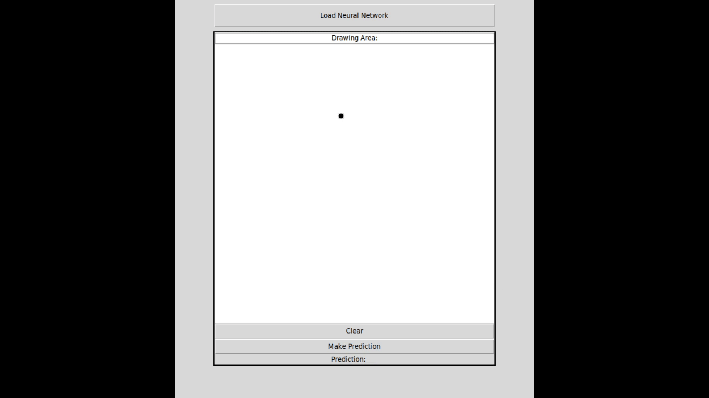

# A Noob's Neural Network

After watching 3Blue1Brown's YouTube videos on [how neural networks
work](https://www.youtube.com/watch?v=aircAruvnKk&list=PLZHQObOWTQDNU6R1_67000Dx_ZCJB-3pi),
I thought to myself that it really isn't that complicated. In order to truly
understand how an artificial neural network works, I decided to make one myself.
The most challenging aspect of this whole project (at least for me) was figuring
out all the derivatives of the cost and activation functions. Also, the way I
handled memory allocation leaves the heap pretty fragmented, and I plan on fixing it in the future.

The ANN I created allows you to train it on any dataset you
provide. The example I used is the MNIST dataset of handwritten digits.

From [Wikipedia](https://en.wikipedia.org/wiki/MNIST_database):
> The MNIST database (Modified National Institute of Standards and Technology
> database[1]) is a large database of handwritten digits that is commonly used
> for training various image processing systems.[2][3] The database is also
> widely used for training and testing in the field of machine learning.[4][5]
> [...] The MNIST database contains 60,000 training images and 10,000 testing
> images.

In addition, I made a small (and terrible) Python app that allows you to draw a
digit yourself and test whether the network correctly predicts it or not.
Currently, the Python app only works on networks that have been trained using the
sigmoid activation function. The file [nn\_saved.bin](nn_saved.bin) contains a
network that I trained on the MNIST training dataset. It has a successfull prediction rate of 97% on
the validation set. I noticed that it is able to recognize the digits
0, 1, 2, 3, 4, 5, and 8 quite reliably. The digit 7 often gets confused with 2
and 9 often gets confused with 7.



## ANN Features 
- **Customizable Network**
  - Adjustable network size (number of total layers).
  - Adjustable layer sizes.
  - Multiple activation functions to choose from.
  - Adaptive learning rate algorithm (experimental).
  - Adjustable learning rate and number of iterations.

- **Training Capabilities**
  - Forward and backward propagation.
- **Other**
  - Simple CPU Multi-Processing support.
  - Save and load networks to/from files.

## Dependencies
- None.

## Build
- Execute ``make`` to build the project.

## Usage Guide (Example)
Refer to the example in [nn\_example.c](nn_example.c) for a step-by-step guide,
covering:
- Creating a new custom network.
- Loading training and validation data.
- Selecting activation functions and the learning rate algorithm.
- Setting the learning rate and the number of iterations.
- Training the network.
- Predicting the outcome of the validation data and evaluating the performance.
- Saving the network to a file.

The two things the example doesn't cover are:
1. Loading/Creating a network from a file.
- If you want to load the network from a file, you have to call the
``nn_load_from_file(<filename>)`` function.
```c
        /* creates network from file */
        struct Neural_Network *nn = nn_load_from_file("filename.bin");
```

2. Enabeling CPU Multi-Processing:
- In order to enable CPU Multi-Processing, you need to set
``NN_ENABLE_MULTI_PROCESSING`` in [neural\_network.h](neural_network.h) to 1:
```c
	#define NN_ENABLE_MULTI_PROCESSING 1
```
